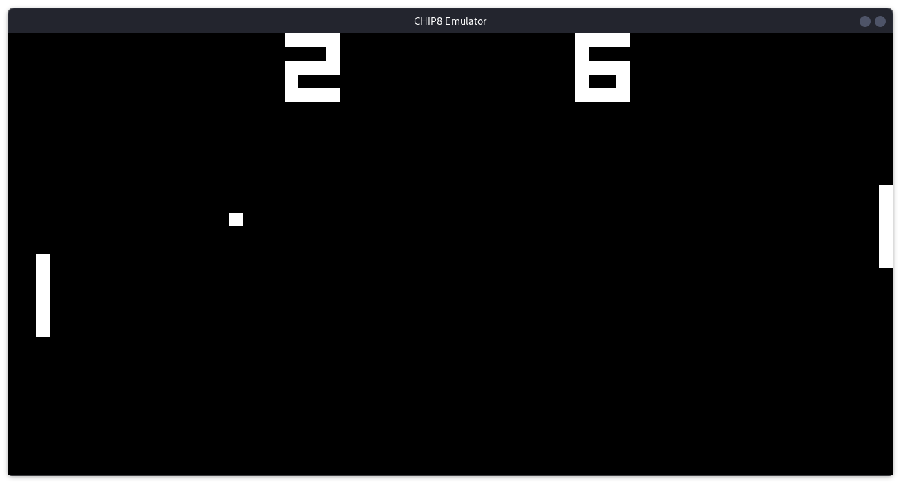
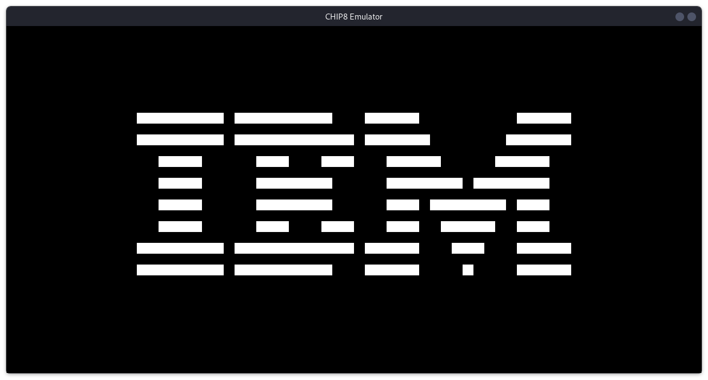

# CHIP-8 Emulator

This is a CHIP-8 emulator written in C++ using the SDL2 library.

## Installation
You will need to download the SDL2 library, install CMake and a C++ compiler

Follow these steps to run the emulator:

1. Clone the repository:
```git clone https://github.com/bordeanu05/chip8_emulator.git```
2. Navigate to the cloned repository and create a new directory named build:
```mkdir build```
3. Navigate to the `build` directory and run `cmake ..`
4. Inside the `build` directory, run `cmake --build ./ -j`
5. To run a ROM file, use the following command:
```./chip8 <ROM_FILE>```

## Screenshots


